<div aling="center">
  
# Trabajo 1: Optimizacion Heurística.

## Redes neuronales y algorítmos bio-inspirados.
## 2024-2   

## Denilson Andrés Molina Truyot
## Universidad Nacional de Colombia
## Sede Medellín

</div>

## 1. Optimización de funciones.

Las funciones elegidas para realizar los siguientes items son: **Función Goldstein-Price** y **Función de Griewank**. Ambas funciones se presentarán para recibir 2 y 3 componentes. Además la función Goldstein-Price no posee extensión a N dimensiones, por lo que se hizo una aproximación teniendo presente el comportamiento en la definición original de esta.

Las implementaciones a usar, se realizarán en Python, y los códigos claves para ello se irán mostrando a medida que se desarrolla el contenido. Además, para optimizar dichas funciones se utilizarán los siguientes métodos:

### 1.1. Optimización numérica por descenso del gradiente.

El descenso de gradiente consta de la siguiente idea: Para encontrar el mínimo de una función, debemos movernos en la dirección opuesta al gradiente de la función en el punto actual (Goodfellow, Bengio, & Courville, 2016, p. 96). El gradiente de una función es un **vector** que contiene las derivadas parciales de la función con respecto a todas sus variables. Indica la dirección de mayor aumento de la función, por lo que moverse en la dirección opuesta al gradiente conduce a la mayor diminusión de esta. Consta de los siguientes pasos.

#### 1.1.1. Inicialización. 

Comienza con un punto inicial aleatorio o específico en el espacio de parámetros. Esto se implementa dependiendo el dominio de interés que se desea estudiar. Para lograr ello se realizará la siguiente función que busca generar un vector, en este caso array, dado las dimensiones y el dominio de la cuadricula que se desee estudiar. 

```python
def gen_rand_X(a,b,N=1,dim=2):
  return np.random.uniform(a, b, size=(N, dim))
```

Siendo *N* el numero de vectores a generar y *dim*, el número de componentes de cada vector en un dominio [a,b].

#### 1.1.2. Calcular gradiente.

Dicho vector, contiene todas las derivadas parciales de cada variable. En este caso se implementa basado en un código reciclado del cuaderno (Zapata & Ospina, 2024).

```python

def partial_dev(x0,f,i,h=0.0001):
  # i: es la i-ésima componente del gradiente y comienza en 0
  e = x0*0.0
  e[i] = h
  y = (f(x0+e) - f(x0-e))/(2*h)
  return(y)

def grad_num(x0,f,h=0.00001):
  y = [partial_dev(x0,f,h,i) for i in range(0,len(x0))]
  y = np.array(y)
  return(y)
```

#### 1.1.3. Definición de iteraciones.

Los vectores que se acercan a una solución óptima se actualizan moviéndose en la dirección opuesta al gradiente. La magnitud del movimiento está determinada por un factor llamado tasa de aprendizaje alpha que es un hiper-parámetro dado antes de realizar el proceso iterativo (Bishop, 2006, p. 45).

<div aling = "center">

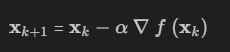

</div>

Esta implementacion se realiza en el siguiente código reciclado del cuaderno anteriormente mencionado y adaptado para los problemas posteriores (Zapata & Ospina, 2024).

```python
def mi_optimizador_num_dif_ndim(x0, g, lr=0.000001, tol=1e-10, max_iter=10000, h=1e-10, monitorCada=1000):
    # Inicialización de variables:
    # x0: punto inicial del vector de entrada en el espacio de soluciones
    # g: función objetivo que queremos minimizar
    # lr: tasa de aprendizaje (learning rate) que determina el tamaño del paso en cada iteración
    # tol: tolerancia para la convergencia del algoritmo
    # max_iter: número máximo de iteraciones permitido
    # h: paso pequeño para calcular la derivada numérica (gradiente)
    # monitorCada: cada cuántas iteraciones imprimir el progreso

    solucion = list()  # Lista para almacenar las soluciones obtenidas en cada iteración
    valor_obj = list()  # Lista para almacenar los valores de la función objetivo evaluados en cada solución
    k = 0  # Contador de iteraciones
    delta_sol = 1  # Diferencia entre soluciones sucesivas, usada para verificar la convergencia

    # Agregando valores iniciales
    # Agregando el valor de x inicial a la lista de soluciones
    solucion.append(x0)
    # Agregando el valor de la función objetivo evaluada en x0 a la lista de valores
    valor_obj.append(g(x0))

    # Mientras delta_sol sea mayor que la tolerancia (tol) y k sea menor que el número máximo de iteraciones (max_iter)
    while (delta_sol > tol) and (k < max_iter):
        # Actualización del punto x usando el gradiente numérico y la tasa de aprendizaje
        x_new = solucion[k] - lr * grad_num(solucion[k], g, h=h)
        # Agregamos la nueva solución a la lista de soluciones
        solucion.append(x_new)
        # Evaluamos la función objetivo en la nueva solución y la añadimos a la lista de valores
        valor_obj.append(g(x_new))
        # Incrementamos el contador de iteraciones
        k = k + 1
        # Calculamos la máxima diferencia absoluta entre la solución anterior y la nueva solución
        delta_sol = np.abs(solucion[k - 1] - solucion[k]).max()
        
        # Monitoreo del progreso cada cierto número de iteraciones
        if (k % monitorCada == 0):
            print(f"Iteración {k}/{max_iter}")  # Imprimimos el número de iteración actual
            # Monitoreo de los cambios en las soluciones
            # print(f"|sol[k-1]-sol[k]| {np.abs(solucion[k-1] - solucion[k])}")
            # Imprimimos la nueva solución y el valor de la función objetivo evaluada en ella
            print(f"X = {x_new}, f = {g(x_new)}\n")
    
    # Devolvemos las soluciones, los valores de la función objetivo y el número de iteraciones realizadas
    return solucion, valor_obj, k
```

### 1.2. Optimización por algorítmos genéticos.

Los algoritmos genéticos son una técnica de optimización motivada en los principios de la evolución biológica, por ejemplo: La selección natural, el cruce (crossover), la mutación, entre otras más (Geeks for Geeks, 2022).

Para realizar la implementación de esta idea, nos apoyaremos en la implementación que realiza la librería PyGad de este tipo de algoritmos, siguiendo los siguientes parámetros y carcaterísticas (Towards Data Science, 2020). Además del reciclado de algunos código del cuaderno anteriormente mencionado (Zapata & Opsina, 2024).

#### 1.2.1. Población inicial.

Definición de un conjunto de soluciones candidatas generadas aleatoriamente. Cada individuo en la población representa una posible solución al problema. Esto se relaciona con los siguientes parámetros que luego se implementará en una instancia de PyGad.

```python

init_range_low = -10.0
init_range_high = 10.0

```

#### 1.2.2. Evaluación por función fitness.

Cada individuo en la población se evalúa utilizando una función de aptitud para determinar qué tan buena es la solución. En nuestro caso, como se desea minimizar la función, la función fitness serán los valores negativos de su definición original, esto es, porque estos algoritmos buscan en esencia maximizar.

```python
def mi_f_fitness(ga_instance, solution, solution_idx):
    y = -f(solution)
    return y
```

#### 1.2.3. Selección.

Con base en su aptitud (Valor de la función fitness) se seleccionan individuos de la población actual para ser padres. Los individuos de la nueva generación reemplazan a los de la generación anterior. Además, la forma en que se realiza el reemplazo puede variar, con el tipo de selección "sss", el reemplazo se realiza de manera que algunos padres se mantienen.

```python
parent_selection_type = "sss"
keep_parents = 1
```

#### 1.2.4. Cruce.

El cruce simulando la recombinación genética, combina pares de padres para crear nuevos individuos. En este caso se implementa el tipo de cruce "single_point" (cruce de un solo punto), que toma un punto en el cromosoma y mezcla las partes de los padres para crear hijos.

```python
crossover_type = "single_point"
```

#### 1.2.5. Mutación.

La mutación otorga variabilidad a los individuos del problema al modificar aleatoriamente algunos genes, ayudando a explorar nuevas áreas del espacio de búsqueda.

```python
mutation_type = "random"
mutation_percent_genes = 10
```

Además de lo anterior, el algoritmo posee un número fijo de generaciones (iteraciones).
```python
num_generations = 50
```

#### 1.2.6. Creación de la instancia.

Dicha instancia, por la definición de parámetros, termina creando un objeto que está listo para correr y así, otorgar un conjunto de soluciones y valores de la función que logren minimizar la función.

```python
ga_instancia = pygad.GA(num_generations=num_generations,
                       num_parents_mating=num_parents_mating,
                       fitness_func=fitness_function,
                       sol_per_pop=sol_per_pop,
                       num_genes=num_genes,
                       init_range_low=init_range_low,
                       init_range_high=init_range_high,
                       gene_space = {'low': -1.0, 'high': 1.0},
                       parent_selection_type=parent_selection_type,
                       keep_parents=keep_parents,
                       crossover_type=crossover_type,
                       mutation_type=mutation_type,
                       mutation_percent_genes=mutation_percent_genes,
                       save_solutions=True)
ga_instancia.run()
```

Obteniendo la mejor solución con `ga_instancia.best_solution()`: 

```python
solution, solution_fitness, solution_idx = ga_instancia.best_solution()
print("Mejor solución : {solution}".format(solution=solution))
print("Valor de la función objetivo = {solution_fitness}".format(solution_fitness=solution_fitness))
print("Posición de la mejor solución = {solution_idx}".format(solution_idx=ga_instancia.solutions_fitness.index(solution_fitness)))
```

### 1.3. Función Goldstein-Price 

#### 1.3.1. 2 Dimensiones.

La definición formal de la función Goldstein-Prince está dada por la siguiente regla (Surjanovic & Bingham, n.d.).

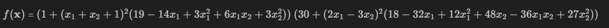

Dado el grado alto de polinomio de la expresión anterior, la función anterior se suele evaluar con el siguiente dominio: *xi* en *[-2,2]* para todo *i=1,2*.

De manera teórica, el mínimo global de la función está en *(x1',x_2')*=(0,-1), tal que *f(x1',x2')=-3*. Dicho valor, es la referencia a la hora de realizar los cálculos posteriores para la optimización de la función. En **figura 1** se puede observar las imagenes de dicha función.

<div aling="center">

**Figura 1. Superficie de la función GoldsteinPrice en su dominio.**


</div>

Con lo anterior, observamos que para valores cercanos a *(x1,x2)=(-2,2)*, la función tendrá a valores por encima de 400 mil, lo que indica que, para valores por fuera del dominio usual, tendrá a infinito. Por lo que, para el análisis nos conentraremos en aquel dominio.

Dependiendo donde se realice el gráfico, esta función presenta varios mínimo locales para puntos cercanos al del mínimo global. En **Figura 2** se observa la curva de nivel cercana a dicho punto global, en otras aproximaciones, se observará como varía dicha curva dependiendo del punto de enfoque.

<div aling="center">

**Figura 2. Curva de nivel enfocada en la ubicación del mínimo global.**


</div>

##### 1.3.1.1. Gradiente Numérico.

Dado la implementación explicada en el item **1.1.** se procederá a realizar la optimización utilizando la dirección opuesta del gradiente, teniendo presente los siguientes parámetros.

```python
def goldstein_price_f(X):
    # Solo 2 dimensiones
    x1=X[0]
    x2=X[1]
    return (1+((x1+x2+1)**2)*(19-14*x1+3*x1**2-14*x2+6*x1*x2+3*x2**2))*(30+((2*x1-3*x2)**2)*(18-32*x1+12*x1**2+48*x2-36*x1*x2+27*x2**2))

# Optimización numérica con gradiente numérico:
sol_ndim_num, f_obj__ndim_num, k_ndim_num = mi_optimizador_num_dif_ndim(x0 = np.array([0.5,-1.5]), 
                                                                        g=goldstein_price_f, 
                                                                        lr = 0.000001, 
                                                                        tol = 0.00000001,
                                                                        max_iter=10000,
                                                                        monitorCada=1000)
```
Obteniendo así los siguientes resultados por consola:

```python
iteracion 1000/10000
X = [ 0.09264418 -1.07035843], f = 10.151353272133916
iteracion 2000/10000
X = [ 0.04085111 -1.0162225 ], f = 3.7358162892233526
iteracion 3000/10000
X = [ 0.02238754 -1.00180975], f = 3.1399037183956144
iteracion 4000/10000
X = [ 0.01348093 -0.99813898], f = 3.041994253796934
iteracion 5000/10000
X = [ 0.00851165 -0.99765461], f = 3.016279812259021
iteracion 6000/10000
X = [ 0.00551307 -0.99802723], f = 3.006970738312517
iteracion 7000/10000
X = [ 0.00362154 -0.99853062], f = 3.003081223216077
iteracion 8000/10000
X = [ 0.00239765 -0.99896144], f = 3.0013744797716635
iteracion 9000/10000
X = [ 0.00159426 -0.99928466], f = 3.0006145148858585
iteracion 10000/10000
X = [ 0.0010626  -0.99951392], f = 3.0002748253306564
```

Sin embargo, esta función es sensible al learning rate y al punto inicial, ya que, si se mueven dichos valores por ejemplo a *(1.5,1.5)* que aparentemente está cerca al mínimo global, este más se acerca, ya que en el punto *(1.2,0.8)* hay un mínimo global con valor de la función 840.

```python
# Optimización numérica con gradiente numérico:
sol_ndim_num, f_obj__ndim_num, k_ndim_num = mi_optimizador_num_dif_ndim(x0 = np.array([1.5,1.5]), 
                                                                        g=goldstein_price_f, 
                                                                        lr = 0.00001, 
                                                                        tol = 0.00000001,
                                                                        max_iter=10000,
                                                                        monitorCada=100)

iteracion 100/10000
X = [1.22767687 0.81685628], f = 841.1251811810017

iteracion 200/10000
X = [1.20326774 0.80200464], f = 840.015218389963

iteracion 300/10000
X = [1.20040442 0.80024828], f = 840.0002322445546

iteracion 400/10000
X = [1.20005032 0.8000309 ], f = 840.0000035938481

iteracion 500/10000
X = [1.20000628 0.80000386], f = 840.000000056044
```

Si se disminuye el learning reate, el número de "saltos" que da el método iterativo será menor, por lo que tardará más en llegar a converger a una solución.

Teniendo presente el valor mínimo global de la función, se puede observar como con la implementación inicial, llega al punto de interés. Esto se puede observar en **Figura 3**.

**Figura 3. Solución óptima de la implementación inicial.**

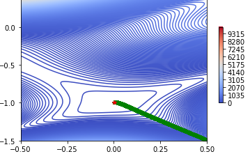

##### 1.3.1.2. Algoritmos genéricos.

Teniendo presente la implementación en **1.2.** dejando los parámetros iniciales presentes, se realizó la siguiente implementación para poder crear la instancia que nos otorgue las soluciones.

```python
# Inicializacion
def goldstein_price_f(X):
    # Solo 2 dimensiones
    x1=X[0]
    x2=X[1]
    return (1+((x1+x2+1)**2)*(19-14*x1+3*x1**2-14*x2+6*x1*x2+3*x2**2))*(30+((2*x1-3*x2)**2)*(18-32*x1+12*x1**2+48*x2-36*x1*x2+27*x2**2))

def mi_f_fitness(ga_instance,solution,solution_idx):
  y = -goldstein_price_f(solution)
  #print(solution)
  return(y)
```

Como se observa anteriormente, solo hay que realizar la configuración a la función de interés, colocandolo de manera negativa, ya que, este algoritmo busca maximizar. Obteniendo así, los siguientes resultados con 200 generaciones.

```python
Mejor solución : [ 0.00578883 -0.99397932]
Valor de la función objetivo = -3.0164792990296845
Posición de la mejor solución = 84
```

Observamos que dicha solución es cercana a la del mínimo global teórico, y utilizando **Figura 4**. Notamos que a partir de la generación 85, el valor de la función tuvo un salto hacia dicho mínimo, logrando converger y oscilar entre dicho resultado.

**Figura 4. Valor de la función -f(x) por cada generación.**

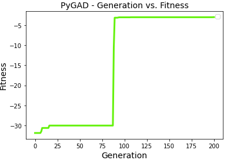

Además, la siguiente animación dada por **Figura 5** muestra el movimiento de particulas y su evolución en cada una de las iteraciones, mostrando que a partir de la mutación aleatoria, terminó convergiendo en el valor óptimo de la función, y desde ahí, fue oscilando en dicho resultado.

**Figura 5. Generaciones encontrando el valor óptimo de la función Goldstein-Price**

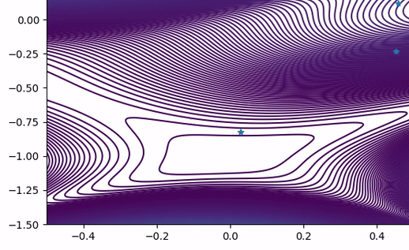

#### 1.3.2. 3 Dimensiones.

La función Goldstein-Prince solo está definida para 2 dimensiones. Sin embargo, se realizó una extrapolación que respetara el comportamiento de la definición original, obteniendo así la siguiente regla:

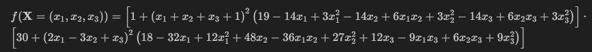

Al igual que en la definición anterior. Dado el grado alto de polinomio de la expresión anterior, la función anterior se suele evaluar con el siguiente dominio: *xi* en *[-2,2]* para todo *i=1,2,3*. De manera teórica, el mínimo global cambió, ahora se encuentra en *(x1'=0,x2'=-1,x3'=-0.2)* con un valor de la función de -0.27 aproximadamente, seguido de un mínimo local dado por *f(0,-1,0)=3*. Esto se puede observar en las proyecciones en 2D y 3D de la función dadas por **Figura 6**.

<div aling="center">

**Figura 6. Proyección de las curvas de nivel y de la superficie dado un valor fijo en Z.**

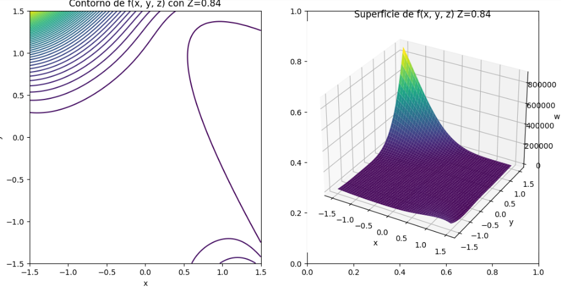

</div>

Con lo anterior, observamos que para valores cercanos a *(x1,x2,x3)=(-2,2,Z)*, la función tendrá a valores por encima de 400 mil, lo que indica que, para valores por fuera del dominio usual, tendrá a infinito. Por lo que, para el análisis nos conentraremos en aquel dominio. Además, como en la definición original de la función, dependiendo donde se realice el gráfico, esta función presenta varios mínimo locales para puntos cercanos al del mínimo global. 

##### 1.3.2.1. Gradiente Numérico.

Dado la implementación explicada en el item **1.1.** se procederá a realizar la optimización utilizando la dirección opuesta del gradiente, teniendo presente los siguientes parámetros y utilizando una condición aleatoria en el vector inicial *x0*, siendo un vector con valores entre -1 y 1, de 3 componentes.

```python
def goldstein_price_3d(X):
  x1 = X[0]
  x2 = X[1]
  x3 = X[2]
  term1 = 1 + (x1 + x2 + x3 + 1)**2 * (19 - 14*x1 + 3*x1**2 - 14*x2 + 6*x1*x2 + 3*x2**2 - 14*x3 + 6*x2*x3 + 3*x3**2)
  term2 = 30 + (2*x1 - 3*x2 + x3)**2 * (18 - 32*x1 + 12*x1**2 + 48*x2 - 36*x1*x2 + 27*x2**2 + 12*x3 - 9*x1*x3 + 6*x2*x3 + 9*x3**2)
  return term1 * term2

# Condicion aleatoria
x0 = gen_rand_X(a=-1,b=1,N=1,dim=3)[0]

# Optimización numérica con gradiente numérico:
sol_ndim_num, f_obj__ndim_num, k_ndim_num = mi_optimizador_num_dif_ndim(x0 = x0,
                                                                        g=goldstein_price_3d,
                                                                        lr = 0.00000001,
                                                                        tol = 0.00000001,
                                                                        max_iter=10000,
                                                                        monitorCada=1000)
```
Obteniendo así los siguientes resultados por consola:

```python
iteracion 1000/10000
X = [-0.17074906 -0.12879312 -0.90368742], f = 103.98516628947469

iteracion 2000/10000
X = [-0.16300368 -0.12489504 -0.89678545], f = 91.68966702326823

...

iteracion 10000/10000
X = [-0.12339956 -0.10519644 -0.86162372], f = 49.59793438965125
```

Notemos que, así como en la definición original de la función, al estar en un punto cercano al mínimo, puede converger a uno de los mínimo globales que tiene en el alrededor, esto se puede observar con la corrida mostrada en **Resultado 1**.

**Resultado 1.**
```python
iteracion 1000/10000
X = [ 0.62202443 -0.53277595 -0.71471597], f = 139.9990680822802

...

iteracion 10000/10000
X = [ 0.56598544 -0.56798884 -0.73918828], f = 84.31977839410618
```

Notemos que en estos resultados, requiere un mayor de iteraciones par que logre converger a una solución. Es por eso, que se realizó una prueba con 1 millón de iteraciones mostrando las salidas cada 100 mil corridas, obteniendo lo siguiente en **Resultado 2**.

**Resultado 2.**
```python
iteracion 100000/1000000
X = [ 0.52365312 -0.70045405 -0.81474611], f = 34.58824803147678

...

iteracion 1000000/1000000
X = [ 0.2834492  -0.76513436 -0.50989112], f = 11.459644808345386
```

Si se aumenta el learning reate, el número de "saltos" que da el método iterativo será mayor, por lo que tardará menos en llegar a converger a una solución, pero aumenta la probabilidad de obtener una solución cercana a un mínimo global, como se muestra en **Resultado 3**.

**Resultado 3.**
```python
iteracion 100/1000
X = [-1.03670199 -0.50882122  0.54798184], f = 30.00718143736922

...

iteracion 500/1000
X = [-1.03766867 -0.50941994  0.54708861], f = 30.000000004944017
```

Lo anterior indica, que dar con el mínimo global dado una condición aleatoria, resulta complejo en temas computaciones y matemáticos por el diseño de este método, ya que, con varias configuraciones en elo hiperparámetros, encuentra o se dirige casi siempre a los mismos mínimos locales, que son los mostrados anteriormente. 

Por otra parte, **Resultado 4** muestra una aproximación a dicho mínimo global, el movimiento de los puntos y su punto inicial, marcado en azul, se muestra en las proyecciones en 3D y 2D, de **Figura 7** y **Figura 8**, respectivamente, donde se observa como en el alrededor de dicho punto, existen varios mínimos locales por dónde el algoritmo tiene la posibilidad de decantarse.

**Resultado 4.**
```python
iteracion 100/1000
X = [ 0.2491825  -0.83791647 -0.06427465], f = 8.317465989732044

...

iteracion 1000/1000
X = [ 0.11314742 -0.92960634 -0.16348629], f = 0.6368436882812986
```

**Figura 7. Solución más cercana al óptimo proyectado en una superficie con Z=0.**

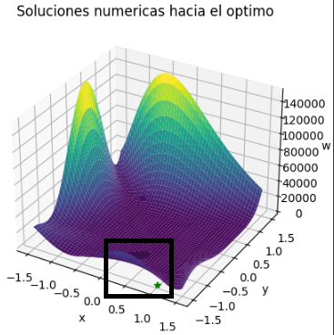

**Figura 8. Solución más cercana al óptimo proyectado en un plano con x1 y x2.**

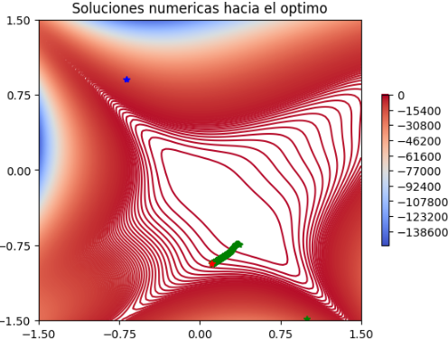


##### 1.3.2.2. Algoritmos genéricos.

Teniendo presente la implementación en **1.2.** dejando los parámetros iniciales presentes, se realizó la siguiente implementación para poder crear la instancia que nos otorgue las soluciones.

```python
# Inicializacion
def goldstein_price_3d(X):
  x1 = X[0]
  x2 = X[1]
  x3 = X[2]
  term1 = 1 + (x1 + x2 + x3 + 1)**2 * (19 - 14*x1 + 3*x1**2 - 14*x2 + 6*x1*x2 + 3*x2**2 - 14*x3 + 6*x2*x3 + 3*x3**2)
  term2 = 30 + (2*x1 - 3*x2 + x3)**2 * (18 - 32*x1 + 12*x1**2 + 48*x2 - 36*x1*x2 + 27*x2**2 + 12*x3 - 9*x1*x3 + 6*x2*x3 + 9*x3**2)
  return term1 * term2

def mi_f_fitness(ga_instance,solution,solution_idx):
  y = -goldstein_price_3d(solution)
  #print(solution)
  return(y)

num_genes = 3
```
Como se observa anteriormente, solo hay que realizar la configuración a la función de interés, colocandolo de manera negativa, ya que, este algoritmo busca maximizar y se cambiaron los números de genes a 3, ya que este indica la cantidad de  variables a tratar. Obteniendo así, los siguientes resultados con 200 generaciones.

```python
Mejor solución : [-0.00412632 -0.99335872 -0.17527493]
Valor de la función objetivo = 0.11322845156583856
Posición de la mejor solución = 9
```

Observamos que dicha solución es cercana a la del mínimo global teórico, y utilizando **Figura 9**. Notamos que a partir de la generación 10, el valor de la función tuvo un salto hacia dicho mínimo, logrando converger y oscilar entre dicho resultado.

**Figura 9. Valor de la función -f(x) por cada generación.**

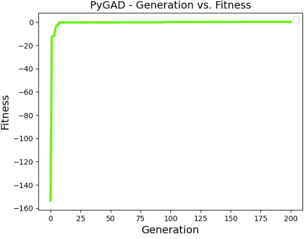

Además, la siguiente animación dada por **Figura 10** muestra el movimiento de particulas y su evolución en cada una de las iteraciones en una proyección al plano, ya que en la proyección en la superficie no se alcanzan a ver el movimiento de los puntos, mostrando que a partir de la mutación aleatoria, terminó convergiendo en el valor óptimo de la función, y desde ahí, fue oscilando en dicho resultado.

**Figura 10. Generaciones encontrando el valor óptimo de la función Goldstein-Price proyectado en el plano con x1 y x2.**

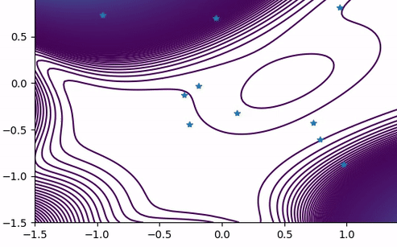


### 1.4. Funcion Griewank.

#### 1.4.1. 2 Dimensiones.

La definición formal de la función Griewank está dada por la siguiente regla (Surjanovic & Bingham, n.d.).

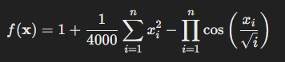

Donde *n* representa la dimensión a tratar. Notemos que dicha productoria es la que convierte a esta función en un benchmark en la optimización global y en problemas de optimización de alto dimensionalidad debido a la generación de mínimos globales. Además, la contribución del término oscilante disminuye cuando la dimensión *n* aumenta, haciendo que el término cuadrático domine el comportamiento global de la función en esas circunstancias.

El dominio de la función suele tratarse en *xi* en *[600,600]* con *i=1,2,...,n* y posee un mínimo global en el origen, con un valor de la función de 0. Esto se puede observar en el gráfico de contorno de **Figura 11**.

<div aling="center">

**Figura 11. Gráfico de contorno de la función Griewank.**

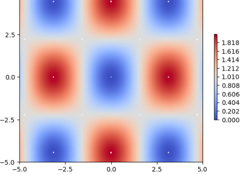

</div>

Notemos que los valores azules indican mínimos y los rojos máximos, por lo que, dado el punto inicial de nuestro método de optimización, dicho valor puede inclinarse a cualquiera de los mínimos que están presentes. Esto se puede observar de una mejor manera en **Figura 12** donde se muestra su superficie.

<div aling="center">

**Figura 12. Superficie de la función Griewank.**

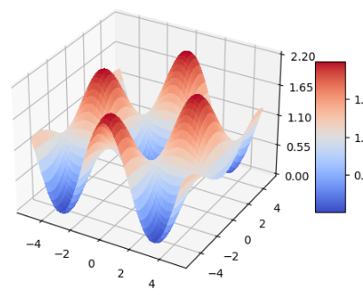

</div>

##### 1.4.1.1. Gradiente Numérico.

Dado la implementación explicada en el item **1.1.** se procederá a realizar la optimización utilizando la dirección opuesta del gradiente, teniendo presente los siguientes parámetros y una condición aleatoria en *x0* que genera un vector de 2 dimensiones con valores de sus componentes entre *[-4.5,4.5]*.

```python
def griewank_f(X):
    #print(X)
    #Para la sumatoria
    fx1 = [(t**2)/(4000) for t in X]
    fx1 = np.array(fx1,dtype=object).sum()

    # Para la productoria

    # Resultados con varios componentes
    fx2=1
    #Dimension de X
    d=len(X)
    # Por cada compontente
    for i in range(0,d):
        # Obtengo la i-esima componente del vector X
        xi=X[i]
        # Calculo la productoria
        fx2=fx2*np.cos((xi)/(np.sqrt(i+1)))

    # Uno los terminos como lo dicta la definicion de la funcion
    return fx1 - fx2 + 1


# Condicion aleatoria
x0 = gen_rand_X(a=-4.5,b=4.5,N=1,dim=2)[0]

# Optimización numérica con gradiente numérico:
sol_ndim_num, f_obj__ndim_num, k_ndim_num = mi_optimizador_num_dif_ndim(x0 = x0,
                                                                        g=griewank_f,
                                                                        lr = 0.001,
                                                                        tol = 0.00000001,
                                                                        max_iter=10000,
                                                                        monitorCada=1000)

```
Obteniendo así los siguientes resultados por consola:

```python
x0=[2.72666176 1.19411277]

iteracion 1000/10000
X = [2.46016813 1.70132522], f = 1.2814849569343612

...

iteracion 10000/10000
X = [3.13832654 4.37048752], f = 0.008552878518890639

```

Observamos que la imagen de la función con valor de 0, se puede obtener en varios puntos. Utilizando los puntos iniciales *x0=[2.72666176 1.19411277], x0=[ 1.8245442  -2.37336047] y x0=[-2.85940711  0.9352097 ]*, se llegan a 3 mínimos locales distintos. Esto se observa en **Figura 13, Figura 14 y Figura 15** respectivamente, donde se muestra el trazo y dirección de cada punto partiendo desde su respectivo *x0* marcado con azul, hasta el mínimo local marcado con rojo.

| **Fig 13.** x0=[2.72666176 1.19411277]  | **Fig 14.** x0=[ 1.8245442  -2.37336047] | **Fig 15.** x0=[-2.85940711  0.9352097] |
|---------------------------------------|---------------------------------------|---------------------------------------|
| 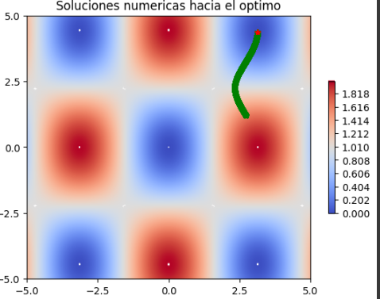 | 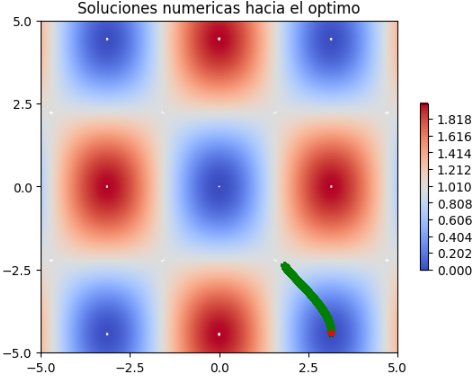 | 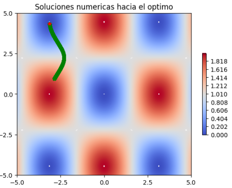 |

##### 1.4.1.2. Algoritmos genéricos.

Teniendo presente la implementación en **1.2.** dejando los parámetros iniciales presentes, se realizó la siguiente implementación para poder crear la instancia que nos otorgue las soluciones.

```python
def griewank_f(X):
    #print(X)
    #Para la sumatoria
    fx1 = [(t**2)/(4000) for t in X]
    fx1 = np.array(fx1,dtype=object).sum()

    # Para la productoria

    # Resultados con varios componentes
    fx2=1
    #Dimension de X
    d=len(X)
    # Por cada compontente
    for i in range(0,d):
        # Obtengo la i-esima componente del vector X
        xi=X[i]
        # Calculo la productoria
        fx2=fx2*np.cos((xi)/(np.sqrt(i+1)))

    # Uno los terminos como lo dicta la definicion de la funcion
    return fx1 - fx2 + 1


def mi_f_fitness(ga_instance,solution,solution_idx):
  y = -griewank_f(solution)
  #print(solution)
  return(y)
```

Como se observa anteriormente, solo hay que realizar la configuración a la función de interés, colocandolo de manera negativa, ya que, este algoritmo busca maximizar. Obteniendo así, los siguientes resultados con 200 generaciones.

```python
Mejor solución : [-0.00974466  0.00185593]
Valor de la función objetivo = -4.8364515093601845e-05
Posición de la mejor solución = 1524
```

Observamos que dicha solución es aproximadamente igua a la del mínimo global teórico, y utilizando **Figura 16**. Notamos que a partir de la generación 152, el valor de la función tuvo un salto hacia dicho mínimo, logrando converger y oscilar entre dicho resultado.

**Figura 16. Valor de la función -f(x) por cada generación.**

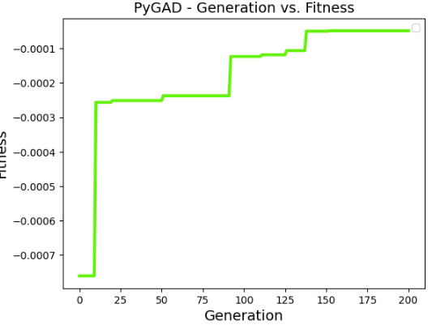

Además, la siguiente animación dada por **Figura 17** muestra el movimiento de particulas y su evolución en cada una de las iteraciones, mostrando que a partir de la mutación aleatoria, terminó convergiendo en el valor óptimo de la función, y desde ahí, fue oscilando en dicho resultado.

**Figura 17. Generaciones encontrando el valor óptimo de la función Griewank**

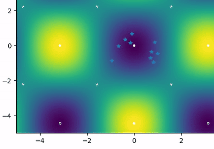

#### 1.4.2. 3 Dimensiones.

La definición de la función de Griewank permite realizar el ejercicio hasta para un *n* arbitrario de dimensiones, por lo que en 3 dimensiones, las proyecciones de la función serían parecidas a las que se muestran en 2. Esto se puede observar en **Figura 18** donde se observan dichas proyecciones en 2D y 3D con un valor de Z fijo.

<div aling="center">

**Figura 18. Proyección de las curvas de nivel y de la superficie dado un valor fijo en Z.**

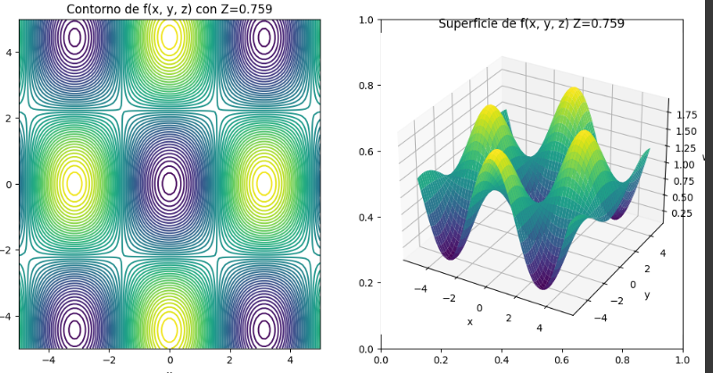

</div>

Con lo anterior observamos que se sigue manteniendo la generación mínimos globales, y que, a alta dimensionalidad, este puede afectar las funciones de optimización que se utilicen. El mínimo valor global de la función sigue siendo 0 que se encuentra en el origen.

##### 1.4.2.1. Gradiente Numérico.

Dado la implementación explicada en el item **1.1.** se procederá a realizar la optimización utilizando la dirección opuesta del gradiente, teniendo presente los siguientes parámetros y utilizando una condición aleatoria en el vector inicial *x0*, siendo un vector con valores entre -1 y 1, de 3 componentes.

```python
def griewank_f(X):
    #print(X)
    #Para la sumatoria
    fx1 = [(t**2)/(4000) for t in X]
    fx1 = np.array(fx1,dtype=object).sum()

    # Para la productoria

    # Resultados con varios componentes
    fx2=1
    #Dimension de X
    d=len(X)
    # Por cada compontente
    for i in range(0,d):
        # Obtengo la i-esima componente del vector X
        xi=X[i]
        # Calculo la productoria
        fx2=fx2*np.cos((xi)/(np.sqrt(i+1)))

    # Uno los terminos como lo dicta la definicion de la funcion
    return fx1 - fx2 + 1

# Condicion aleatoria
x0 = gen_rand_X(a=-4.5,b=4.5,N=1,dim=3)[0]

# Optimización numérica con gradiente numérico:
sol_ndim_num, f_obj__ndim_num, k_ndim_num = mi_optimizador_num_dif_ndim(x0 = x0,
                                                                        g=griewank_f,
                                                                        lr = 0.001,
                                                                        tol = 0.00000001,
                                                                        max_iter=10000,
                                                                        monitorCada=1000)

```
Obteniendo así los siguientes resultados por consola:

```python
iteracion 1000/10000
X = [ 0.11481375 -3.1524121  -0.8224104 ], f = 1.543167444522127

...

iteracion 10000/10000
X = [ 0.00074553 -0.09031732 -0.14768457], f = 0.0056718939851228
```

Notemos que, en este caso, con la condición inicial aleatoria, llegó a una aproximación del mínimo global. Además, al tener mayor dimensionalidad, este va a requerir mayor número de iteraciones para alcanzar la convergencia de los valores de x. Además, para este caso, se mostrará la proyección en 3D (Ya que es la única forma de mostrar x,y,z,f(x,y,z)) para observar como los puntos se acercan a un mínimo en 4 dimensiones. En este caso, solo se muestra el movimiento de *x1* y *x2*, por lo que, sin la información de *x3*, el gráfico mostrado no es exacto. Con lo anterior, se observa en **Figura 19, Figura 20 y Figura 21** respectivamente, donde se muestra el trazo y dirección de cada punto partiendo desde su respectivo *x0* marcado con azul, hasta el mínimo local marcado con rojo y cómo este varía dado el punto inicial, como lo hacía la función con dominio en *R2*.

| **Fig 19.** x0=[-0.574, -1.026, 0.890]  | **Fig 20.** x0=[ 4.223, -1.287, 2.263] | **Fig 21.** x0=[-2.695, -4.262, 2.637 ] |
|---------------------------------------|---------------------------------------|---------------------------------------|
| 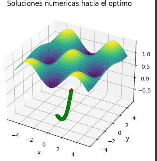 | 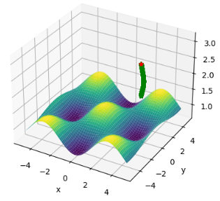 | 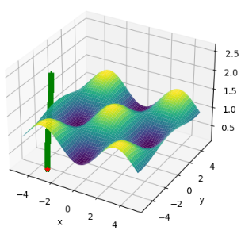 |

##### 1.4.2.2. Algoritmos genéricos.

Teniendo presente la implementación en **1.2.** dejando los parámetros iniciales presentes, se realizó la siguiente implementación para poder crear la instancia que nos otorgue las soluciones.

```python
def griewank_f(X):
    #print(X)
    #Para la sumatoria
    fx1 = [(t**2)/(4000) for t in X]
    fx1 = np.array(fx1,dtype=object).sum()

    # Para la productoria

    # Resultados con varios componentes
    fx2=1
    #Dimension de X
    d=len(X)
    # Por cada compontente
    for i in range(0,d):
        # Obtengo la i-esima componente del vector X
        xi=X[i]
        # Calculo la productoria
        fx2=fx2*np.cos((xi)/(np.sqrt(i+1)))

    # Uno los terminos como lo dicta la definicion de la funcion
    return fx1 - fx2 + 1

# Condicion aleatoria
x0 = gen_rand_X(a=-4.5,b=4.5,N=1,dim=3)[0]

def mi_f_fitness(ga_instance,solution,solution_idx):
  y = -griewank_f(solution)
  #print(solution)
  return(y)

num_genes = 3
```
Como se observa anteriormente, solo hay que realizar la configuración a la función de interés, colocandolo de manera negativa, ya que, este algoritmo busca maximizar y se cambiaron los números de genes a 3, ya que este indica la cantidad de  variables a tratar. Obteniendo así, los siguientes resultados con 200 generaciones.

```python
Mejor solución : [ 0.00287773 -0.00132641  0.00168141]
Valor de la función objetivo = -5.054909763768656e-06
Posición de la mejor solución = 1556
```

Observamos que dicha solución es cercana a la del mínimo global teórico, y utilizando **Figura 22**. Notamos que a partir de la generación 10, el valor de la función tuvo un salto hacia dicho mínimo, logrando converger y oscilar entre dicho resultado.

**Figura 22. Valor de la función -f(x) por cada generación.**

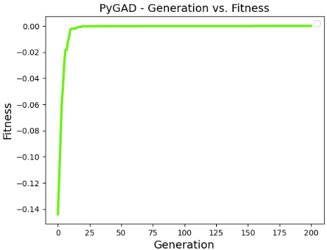

Además, la siguiente animación dada por **Figura 23** muestra el movimiento de particulas y su evolución en cada una de las iteraciones en una proyección al plano, ya que en la proyección en la superficie no se alcanzan a ver el movimiento de los puntos, mostrando que a partir de la mutación aleatoria, terminó convergiendo en el valor óptimo de la función, y desde ahí, fue oscilando en dicho resultado.

**Figura 23. Generaciones encontrando el valor óptimo de la función Griewank proyectado en el plano con x1 y x2.**

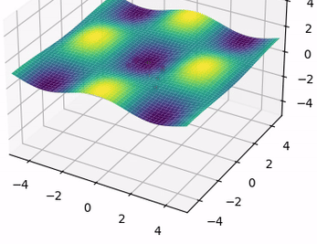


### 1.5. Conclusiones.

1. El método de descenso por gradiente, dado los resultados obtenidos en cada uno de los 4 items de práctica, podemos observar que a mayor dimensionalidad, le cuesta más obtener dicho mínimo global, requiere un mayor número de iteraciones, y si se usan funciones con problemas en sus derividas o que tengan muchos mínimo locales, como en el caso de las funciones estudiadas en los items **1.3** y **1.4**, este convergerá prontamente y no al resultado esperado.

2. Los algoritmos genéticos, al tener más posibilidades tanto de iteraciones como de solución por población suelen tener más coste computacional y en muchos casos, llega a converger a una solución local, esto ocurrió cuando se trabajaron las funciones aplicadas en 3 dimensiones. Sin embargo, la solución que suele dar es aproximadamente global y logra converger en alguna de sus generaciones.

3. Con el learning rate adecuado, el método de descenso por gradiente termina convergiendo así la función no sea suave o convexa, lo que le da cierta flexibilidad. Sin embargo, para problemas donde la condición incial es aleatoria, no se garantiza que converge al mínimo global, esto ocurrió en la apliación mostrada en el item **1.4.1.1.**.

4. A pesar de que requiere una mayor configuración y previo estudio, el método de algoritmos genéticos tiene mayor oportunidad para problemas de optimización, ya que con la recombinación, se puede obtener mayores combinaciones por población que logren llegar al resultado de la función objetivo deseado.

5. En general, los mejores resultados, con menos corridas, iteraciones, aunque con más costo computacional se obtuvieron con los algoritmos genéticos. Sin embargo, desde el punto de vista de la configuración e implementación, el método de descenso de gradiente muestra ser más facil de implementar asegura la convergencia a una solución (no oscila, como en el caso de algoritmos genéticos) aunque esta no sea global.


## Referencias.

* Surjanovic, S., & Bingham, D. (n.d.). Goldstein-Price Function. Simon Fraser University. Recuperado el 29 de agosto de 2024, de https://www.sfu.ca/~ssurjano/goldpr.html.

* Goodfellow, I., Bengio, Y., & Courville, A. (2016). Deep Learning. MIT Press.

* Bishop, C. M. (2006). Pattern Recognition and Machine Learning. Springer.

* Zapata, & Ospina. (2024). IRNA202401_intro_optim.ipynb [Cuaderno de Python].

* Towards Data Science. (2020). Introduction to Genetic Algorithms — Including Example Code. Recuperado de https://towardsdatascience.com/introduction-to-genetic-algorithms-including-example-code-e396e98d8bf3.

* Geeks for Geeks. (2022). Introduction to Genetic Algorithm. Recuperado de https://www.geeksforgeeks.org/introduction-to-genetic-algorithm/.

* Surjanovic, S., & Bingham, D. (n.d.). Griewank Function. Simon Fraser University. Recuperado el 29 de agosto de 2024, de https://www.sfu.ca/~ssurjano/griewank.html
