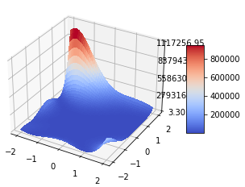

  
# Trabajo 1: Optimizacion Heurística.

## Redes neuronales y algorítmos bio-inspirados.
## 2024-2   

## Denilson Andrés Molina Truyot
## Universidad Nacional de Colombia
## Sede Medellín

## Optimización de funciones.

Las funciones elegidas para realizar los siguientes items son: **Función Goldstein-Price** y **Función de Griewank**. Ambas funciones se presentarán para recibir 2 y 3 componentes. Además la función Goldstein-Price no posee extensión a N dimensiones, por lo que se hizo una aproximación teniendo presente el comportamiento en la definición original de esta.

### Función Goldstein-Price 

#### 2 Dimensiones.

La definición formal de la función Goldstein-Prince está dada por la siguiente regla (Surjanovic & Bingham, n.d.).

$f(\textbf{x})$ = $(1+(x_1+x_2+1)^{2}(19-14x_1+3x_1^{2}+6x_1x_2+3x_2^{2}))$ $(30+(2x_1-3x_2)^{2}(18-32x_1+12x_1^{2}+48x_2-36x_1x_2+27x_2^{2}))$

Dado el grado alto de polinomio de la expresión anterior, la función anterior se suele evaluar con el siguiente dominio: $x_i \in [-2,2]$ para todo $i=1,2$.

De manera teórica, el mínimo global de la función está en $(x_1*,x_2*)=(0,-1)$, tal que $f(x_1*,x_2*)=-3$. Dicho valor, es la referencia a la hora de realizar los cálculos posteriores para la optimización de la función. En **figura 1** se puede observar las imagenes de dicha función.

Observamos que para valores cercanos a $(x_1,x_2)=(-2,2)$, la función tendrá a valores por encima de 400 mil, lo que indica que, para valores por fuera del dominio usual, tendrá a infinito. Por lo que, para el análisis nos conentraremos en aquel dominio.

## Referencias.

* Surjanovic, S., & Bingham, D. (n.d.). Goldstein-Price Function. Simon Fraser University. Recuperado el 29 de agosto de 2024, de https://www.sfu.ca/~ssurjano/goldpr.html
