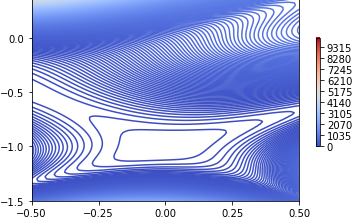

# Trabajo 1: Optimizacion Heurística.

## Redes neuronales y algorítmos bio-inspirados.

## 2024-2   

## Denilson Andrés Molina Truyot

## Universidad Nacional de Colombia

## Sede Medellín

## 1. Optimización de funciones.

Las funciones elegidas para realizar los siguientes items son: **Función Goldstein-Price** y **Función de Griewank**. Ambas funciones se presentarán para recibir 2 y 3 componentes. Además la función Goldstein-Price no posee extensión a N dimensiones, por lo que se hizo una aproximación teniendo presente el comportamiento en la definición original de esta.

Las implementaciones a usar, se realizarán en Python, y los códigos claves para ello se irán mostrando a medida que se desarrolla el contenido. Además, para optimizar dichas funciones se utilizarán los siguientes métodos:

### 1.1. Optimización numérica por descenso del gradiente.

El descenso de gradiente consta de la siguiente idea: Para encontrar el mínimo de una función, debemos movernos en la dirección opuesta al gradiente de la función en el punto actual (Goodfellow, Bengio, & Courville, 2016, p. 96). El gradiente de una función es un **vector** que contiene las derivadas parciales de la función con respecto a todas sus variables. Indica la dirección de mayor aumento de la función, por lo que moverse en la dirección opuesta al gradiente conduce a la mayor diminusión de esta. Consta de los siguientes pasos.

#### 1.1.1. Inicialización. 

Comienza con un punto inicial aleatorio o específico en el espacio de parámetros. Esto se implementa dependiendo el dominio de interés que se desea estudiar. Para lograr ello se realizará la siguiente función que busca generar un vector, en este caso array, dado las dimensiones y el dominio de la cuadricula que se desee estudiar. 

```python
def gen_rand_X(a,b,N=1,dim=2):
  return np.random.uniform(a, b, size=(N, dim))
```

Siendo *N* el numero de vectores a generar y *dim*, el número de componentes de cada vector en un dominio $[a,b]$.

#### 1.1.2. Calcular gradiente $\nabla$ $f$ $(\textbf{x})$.

Dicho vector, contiene todas las derivadas parciales de cada variable. En este caso se implementa basado en un código reciclado del cuaderno (Zapata & Ospina, 2024).

```python

def partial_dev(x0,f,i,h=0.0001):
  # i: es la i-ésima componente del gradiente y comienza en 0
  e = x0*0.0
  e[i] = h
  y = (f(x0+e) - f(x0-e))/(2*h)
  return(y)

def grad_num(x0,f,h=0.00001):
  y = [partial_dev(x0,f,h,i) for i in range(0,len(x0))]
  y = np.array(y)
  return(y)
```

#### 1.1.3. Definición de iteraciones.

Los vectores que se acercan a una solución óptima se actualizan moviéndose en la dirección opuesta al gradiente. La magnitud del movimiento está determinada por un factor llamado tasa de aprendizaje $\alpha$ que es un hiper-parámetro dado antes de realizar el proceso iterativo (Bishop, 2006, p. 45).

<div aling = "center">

$\textbf{x}_{k+1}$ = $\textbf{x}_{k} - \alpha $ $\nabla$ $f$ $(\textbf{x}_{k})$

</div>

Esta implementacion se realiza en el siguiente código reciclado del cuaderno anteriormente mencionado y adaptado para los problemas posteriores (Zapata & Ospina, 2024).

```python
def mi_optimizador_num_dif_ndim(x0, g, lr=0.000001, tol=1e-10, max_iter=10000, h=1e-10, monitorCada=1000):
    # Inicialización de variables:
    # x0: punto inicial del vector de entrada en el espacio de soluciones
    # g: función objetivo que queremos minimizar
    # lr: tasa de aprendizaje (learning rate) que determina el tamaño del paso en cada iteración
    # tol: tolerancia para la convergencia del algoritmo
    # max_iter: número máximo de iteraciones permitido
    # h: paso pequeño para calcular la derivada numérica (gradiente)
    # monitorCada: cada cuántas iteraciones imprimir el progreso

    solucion = list()  # Lista para almacenar las soluciones obtenidas en cada iteración
    valor_obj = list()  # Lista para almacenar los valores de la función objetivo evaluados en cada solución
    k = 0  # Contador de iteraciones
    delta_sol = 1  # Diferencia entre soluciones sucesivas, usada para verificar la convergencia

    # Agregando valores iniciales
    # Agregando el valor de x inicial a la lista de soluciones
    solucion.append(x0)
    # Agregando el valor de la función objetivo evaluada en x0 a la lista de valores
    valor_obj.append(g(x0))

    # Mientras delta_sol sea mayor que la tolerancia (tol) y k sea menor que el número máximo de iteraciones (max_iter)
    while (delta_sol > tol) and (k < max_iter):
        # Actualización del punto x usando el gradiente numérico y la tasa de aprendizaje
        x_new = solucion[k] - lr * grad_num(solucion[k], g, h=h)
        # Agregamos la nueva solución a la lista de soluciones
        solucion.append(x_new)
        # Evaluamos la función objetivo en la nueva solución y la añadimos a la lista de valores
        valor_obj.append(g(x_new))
        # Incrementamos el contador de iteraciones
        k = k + 1
        # Calculamos la máxima diferencia absoluta entre la solución anterior y la nueva solución
        delta_sol = np.abs(solucion[k - 1] - solucion[k]).max()
        
        # Monitoreo del progreso cada cierto número de iteraciones
        if (k % monitorCada == 0):
            print(f"Iteración {k}/{max_iter}")  # Imprimimos el número de iteración actual
            # Monitoreo de los cambios en las soluciones
            # print(f"|sol[k-1]-sol[k]| {np.abs(solucion[k-1] - solucion[k])}")
            # Imprimimos la nueva solución y el valor de la función objetivo evaluada en ella
            print(f"X = {x_new}, f = {g(x_new)}\n")
    
    # Devolvemos las soluciones, los valores de la función objetivo y el número de iteraciones realizadas
    return solucion, valor_obj, k
```

### Función Goldstein-Price 

#### 2 Dimensiones.

La definición formal de la función Goldstein-Prince está dada por la siguiente regla (Surjanovic & Bingham, n.d.).

$f(\textbf{x})$ = $(1+(x_1+x_2+1)^{2}(19-14x_1+3x_1^{2}+6x_1x_2+3x_2^{2}))$ $(30+(2x_1-3x_2)^{2}(18-32x_1+12x_1^{2}+48x_2-36x_1x_2+27x_2^{2}))$

Dado el grado alto de polinomio de la expresión anterior, la función anterior se suele evaluar con el siguiente dominio: $x_i \in [-2,2]$ para todo $i=1,2$.

De manera teórica, el mínimo global de la función está en $(x_1*,x_2*)=(0,-1)$, tal que $f(x_1*,x_2*)=-3$. Dicho valor, es la referencia a la hora de realizar los cálculos posteriores para la optimización de la función. En **figura 1** se puede observar las imagenes de dicha función.

**Figura 1. Superficie de la función GoldsteinPrice en su dominio.**

<div aling="center">


</div>

Con lo anterior, observamos que para valores cercanos a $(x_1,x_2)=(-2,2)$, la función tendrá a valores por encima de 400 mil, lo que indica que, para valores por fuera del dominio usual, tendrá a infinito. Por lo que, para el análisis nos conentraremos en aquel dominio.

Dependiendo donde se realice el gráfico, esta función presenta varios mínimo locales para puntos cercanos al del mínimo global. En **Figura 2** se observa la curva de nivel cercana a dicho punto global, en otras aproximaciones, se observará como varía dicha curva dependiendo del punto de enfoque


**Figura 2. Curva de nivel enfocada en la ubicación del mínimo global.**

<div aling="center">



</div>


## Referencias.

* Surjanovic, S., & Bingham, D. (n.d.). Goldstein-Price Function. Simon Fraser University. Recuperado el 29 de agosto de 2024, de https://www.sfu.ca/~ssurjano/goldpr.html.

* Goodfellow, I., Bengio, Y., & Courville, A. (2016). Deep Learning. MIT Press.

* Bishop, C. M. (2006). Pattern Recognition and Machine Learning. Springer.

* David, & Juan. (2024). IRNA202401_intro_optim.ipynb [Cuaderno de Python].
